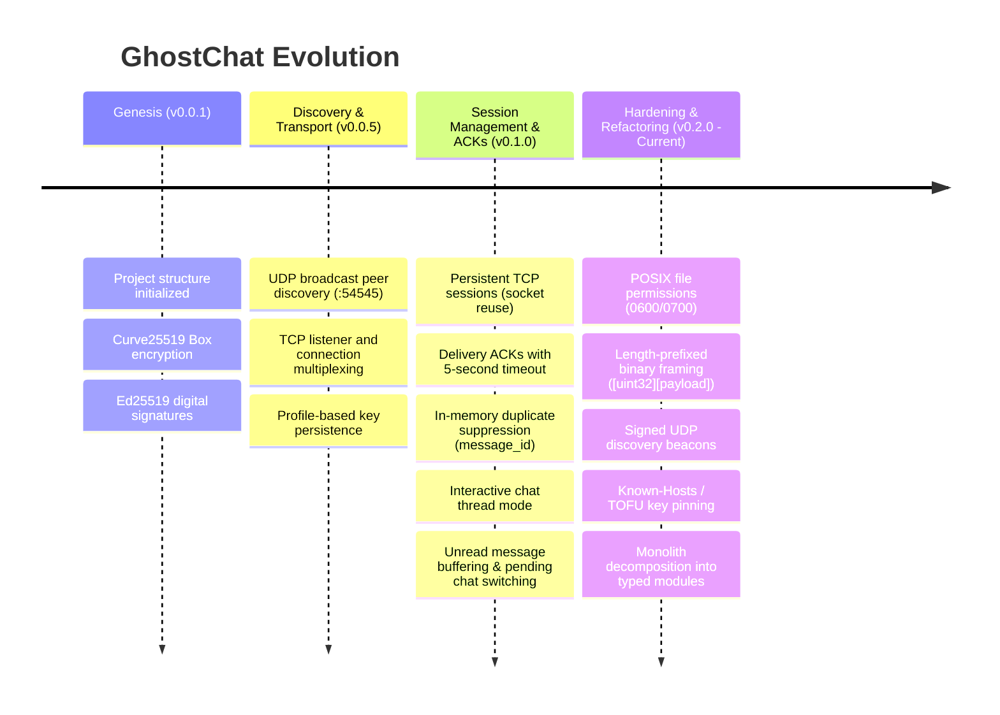

# GhostChat: Systems Engineering & Applied Cryptography Learning Journal

> A comprehensive deep-dive into the architectural evolution, distributed systems concepts, security audits, vulnerabilities discovered, and foundational engineering fixes implemented in GhostChat.

---

## 1. Project Vision & Philosophy

GhostChat was conceived not merely as a chat client, but as a **learning scaffold for applied cryptography and distributed systems engineering**. 

Traditional web applications rely on centralized servers, cloud databases, and trusted brokers. In contrast, GhostChat operates on a decentralized peer-to-peer (P2P) model where:
- **Every node is simultaneously a client and a server.**
- **There is no central database, authority, or message relay.**
- **No plaintext ever crosses the wire.**
- **Communication occurs directly between autonomous machines over local networks.**

Building such a system exposes real-world engineering challenges that higher-level frameworks usually hide: byte-level network framing, partial network failures, socket race conditions, cryptographic identity binding, and local state synchronization.

---

## 2. Chronological Milestones: What Has Been Built So Far

GhostChat has progressed through several foundational iterations:



### Key Architectural Modules

| Module | Location | Purpose & Mechanics |
| :--- | :--- | :--- |
| **Crypto Core** | `ghostchat/crypto/keys.py` | Generates X25519 keypairs (for encryption) and Ed25519 keypairs (for signatures). Persists keys to `~/.ghostchat/<profile>/`. Derives 16-character hex fingerprints. |
| **Encryption** | `ghostchat/crypto/encrypt.py` | Implements authenticated public-key encryption via `nacl.public.Box` (Curve25519 Diffie-Hellman + XSalsa20 stream cipher + Poly1305 MAC). |
| **Signing** | `ghostchat/crypto/signing.py` | Ed25519 digital signatures to verify sender identity and detect message tampering. |
| **Peer Discovery** | `ghostchat/network/discovery.py` | Periodically broadcasts UDP packets to `255.255.255.255:54545`. Listens for beacons and maintains an active peer table, pruning nodes inactive for > 8s. |
| **Transport** | `ghostchat/network/transport.py` | Manages persistent TCP connections mapped by `peer_id -> socket`. Uses per-peer write locks for thread safety, delivery ACKs via threading events, and deduplication. |
| **UI & CLI** | `ghostchat/ui/terminal.py`, `main.py` | Rich-based terminal rendering (peer panels, event logs) and command loop (`/msg`, `/chat`, `/chat switch`, `/peers`). |

---

## 3. Deep-Dive: Problems Discovered, Foundations & How We Fixed Them

During a comprehensive architectural and security audit, several critical flaws were identified in the v0.1.0 codebase. Below is the detailed breakdown of each problem, the underlying computer science and systems principle, and how it is resolved.

---

### Problem 1: Insecure Private Key Storage & POSIX Permissions

#### What Was Wrong
In `ghostchat/crypto/keys.py`, private keys were written to disk using Python's standard `Path.write_text()`:
```python
# VULNERABLE CODE (v0.1.0)
def _write_private_key(path: Path, raw: bytes) -> None:
    path.write_text(base64.b64encode(raw).decode("ascii"), encoding="utf-8")
```
When creating files without explicit permissions, POSIX operating systems (macOS, Linux) apply the user's default `umask` (often `0022` or `0002`). This resulted in private keys created with permissions `0644` (`-rw-r--r--`) and directories with `0755` (`drwxr-xr-x`).

#### The Foundation: Principle of Least Privilege in POSIX Security
In any multi-user environment or on a system running multiple local background agents or processes, permissions of `0644` allow **any local process** to read your private keys. With read access to `enc_private.key` and `sign_private.key`, an attacker can:
1. Decrypt all past and future intercepted messages sent to you.
2. Forge digital signatures to impersonate you completely.

#### How We Fixed It
Private keys must be strictly readable and writable only by the file owner (`0600` / `-rw-------`), and the parent directory must only be accessible by the owner (`0700` / `drwx------`):

```python
# REMEDIATED CODE (v0.2.0)
import os

def _write_private_key(path: Path, raw: bytes) -> None:
    # Use os.open with explicit O_CREAT | O_WRONLY | O_TRUNC and mode 0o600
    encoded = base64.b64encode(raw).decode("ascii").encode("utf-8")
    flags = os.O_WRONLY | os.O_CREAT | os.O_TRUNC
    fd = os.open(path, flags, 0o600)
    try:
        with open(fd, "wb", closefd=True) as f:
            f.write(encoded)
    except Exception:
        os.close(fd)
        raise
    # Explicitly ensure permissions are locked even if umask interfered
    os.chmod(path, 0o600)

def ensure_key_dir(key_dir: Path) -> None:
    key_dir.mkdir(parents=True, exist_ok=True)
    os.chmod(key_dir, 0o700)
```

---

### Problem 2: TCP Stream Framing vs. Memory-Exhaustion DoS

#### What Was Wrong
In `ghostchat/network/transport.py`, incoming connections were parsed using `f.readline()` on line-delimited JSON:
```python
# VULNERABLE CODE (v0.1.0)
f = conn.makefile("rb")
while not self._stop_event.is_set():
    line = f.readline()  # Reads indefinitely until \n is encountered!
    if not line:
        break
    packet = json.loads(line.decode("utf-8"))
```

#### The Foundation: Stream Protocols & Boundary Demarcation
TCP is a **byte stream protocol**, not a packet/message protocol. TCP guarantees ordered, reliable byte delivery, but it has no intrinsic knowledge of "messages". An application must define its own framing:
1. **Delimiter-based framing (e.g., `\n`)**: Extremely fragile. If an attacker connects and continuously sends raw bytes without ever transmitting `\n`, `f.readline()` continues buffering bytes into memory until the operating system terminates the process due to Out-Of-Memory (OOM).
2. **Length-prefixed framing**: Every frame begins with a fixed-size header specifying the length of the upcoming payload.

#### How We Fixed It
We introduced standard **Length-Prefixed Binary Framing**:
```
+------------------------------------+---------------------------------------------+
| 4 Bytes: uint32 (Big-Endian `!I`)   | N Bytes: JSON Payload (UTF-8)               |
| Length of Payload (Max: 64 KB)     | Message / ACK / Handshake packet           |
+------------------------------------+---------------------------------------------+
```

```python
# REMEDIATED CODE (v0.2.0)
import struct

MAX_PACKET_SIZE = 65536  # 64 KB guardrail against memory exhaustion

class FramingCodec:
    @staticmethod
    def encode_frame(payload_bytes: bytes) -> bytes:
        if len(payload_bytes) > MAX_PACKET_SIZE:
            raise ValueError(f"Payload size {len(payload_bytes)} exceeds maximum {MAX_PACKET_SIZE}")
        # Pack 4-byte big-endian unsigned integer
        header = struct.pack("!I", len(payload_bytes))
        return header + payload_bytes

    @staticmethod
    def read_exact(sock: socket.socket, num_bytes: int) -> bytes:
        buf = bytearray()
        while len(buf) < num_bytes:
            chunk = sock.recv(num_bytes - len(buf))
            if not chunk:
                raise ConnectionError("Socket closed during read")
            buf.extend(chunk)
        return bytes(buf)

    @classmethod
    def read_frame(cls, sock: socket.socket) -> bytes:
        header = cls.read_exact(sock, 4)
        (length,) = struct.unpack("!I", header)
        if length > MAX_PACKET_SIZE:
            raise ValueError(f"Incoming frame length {length} exceeds {MAX_PACKET_SIZE}. Dropping.")
        return cls.read_exact(sock, length)
```
*Benefits*:
- Complete immunity to unbounded buffer DoS attacks.
- Exact byte allocation before reading payloads.
- Payload content can contain arbitrary binary or string data without breaking framing.

---

### Problem 3: Unauthenticated UDP Discovery (Identity Spoofing & MITM)

#### What Was Wrong
In `ghostchat/network/discovery.py`, discovery packets were broadcast without any cryptographic authentication:
```json
// VULNERABLE DISCOVERY PACKET (v0.1.0)
{
  "type": "DISCOVER",
  "peer_id": "alice_id",
  "username": "alice",
  "port": 5001,
  "enc_public_key": "...",
  "sign_public_key": "..."
}
```
Any host on the LAN could send this packet. A malicious actor could broadcast a packet with `peer_id = "alice_id"`, `username = "alice"`, but substitute their own `enc_public_key` and `sign_public_key`. When other peers sent encrypted messages to "alice", they would encrypt with the attacker's key (Man-in-the-Middle attack).

#### The Foundation: Cryptographic Identity Binding & Proof of Ownership
To claim an identity, a node must prove it controls the private key associated with that identity. This is accomplished by signing the advertised discovery information using the node's Ed25519 signing key.

#### How We Fixed It
1. **Canonical Signing String**: We concatenate the canonical fields:
   `f"{peer_id}:{username}:{port}:{enc_public_key}:{sign_public_key}"`
2. **Signature Inclusion**: The sender signs this string and appends the base64 signature to the packet:
```python
# REMEDIATED DISCOVERY (v0.2.0)
canonical_data = f"{self.peer_id}:{self.username}:{self.tcp_port}:{self.enc_public_key_b64}:{self.sign_public_key_b64}"
packet["signature"] = sign_message(self.sign_private_key, canonical_data)
```
3. **Verification on Ingestion**: The receiver extracts `sign_public_key`, reconstructs the canonical string, and verifies the signature using `verify_signature()`. If the signature fails or fields have been tampered with, the packet is immediately dropped.

---

### Problem 4: Key Pinning & Trust-On-First-Use (TOFU)

#### What Was Wrong
When a peer disconnected and later reconnected with a different public key (e.g. from an attacker or key rotation), GhostChat simply updated `self._peers[peer_id]` with the new key without alerting the user.

#### The Foundation: Trust-On-First-Use (TOFU) vs. PKI
Centralized systems use Certificate Authorities (CAs) to validate public keys. In decentralized P2P networks where CAs do not exist, systems use **Trust-On-First-Use (TOFU)** (the model popularized by OpenSSH):
- The first time you connect with a peer, you trust and "pin" their cryptographic identity (their verify key / encryption key).
- On subsequent connections, if the peer's keys change unexpectedly, the system flags a high-priority security warning:
  > *"WARNING: REMOTE HOST IDENTIFICATION HAS CHANGED! Someone could be eavesdropping on you right now."*

#### How We Fixed It
We introduced `ghostchat/crypto/known_hosts.py`:
- Maintains a persistent, profile-specific registry in `~/.ghostchat/<profile>/known_hosts.json`.
- Keys are pinned by `(username, peer_id)`.
- When receiving a message or discovery beacon:
  - If new: Auto-pin the keypair.
  - If existing: Assert that the incoming public keys match the pinned keys.
  - If mismatch: Return a security error and refuse automated communication until manually confirmed.

---

### Problem 5: Monolithic Architecture & Separation of Concerns

#### What Was Wrong
Static analysis with `debt_scanner.py` revealed:
- `ghostchat/main.py` was **483 lines long**.
- Cyclomatic complexity of `main()` was **74** (industry threshold for refactoring is typically 10–15).
- It contained 9 nested functions and entangled CLI argument parsing, packet formatting, session state, unread buffers, and network event handlers.

#### The Foundation: Separation of Concerns (SoC) & Testability
When networking, state machines, and terminal UI logic are tightly coupled in a single procedural loop:
1. Automated unit testing is virtually impossible without launching real network sockets.
2. Concurrency bugs (race conditions between socket callbacks and terminal inputs) become extremely difficult to trace.
3. Adding new features (like file transfers or group chats) exponentially increases complexity.

#### How We Fixed It
The codebase was refactored into distinct, single-responsibility modules:

```
ghostchat/
├── __init__.py               # Package identity & version (v0.2.0)
├── crypto/
│   ├── __init__.py
│   ├── keys.py               # Keypair generation, 0600/0700 file security
│   ├── encrypt.py            # Box encryption/decryption
│   ├── signing.py            # Ed25519 signing & verification
│   └── known_hosts.py        # TOFU key pinning (~/.ghostchat/known_hosts.json)
├── protocol/
│   ├── __init__.py
│   └── packets.py            # Typed packet dataclasses & FramingCodec (Length-prefix)
├── network/
│   ├── __init__.py
│   ├── discovery.py          # Signed UDP discovery service
│   └── transport.py          # Length-prefixed TCP multiplexing & delivery ACKs
├── session/
│   ├── __init__.py
│   └── manager.py            # Pure state machine (active thread, unread queue)
├── ui/
│   ├── __init__.py
│   └── terminal.py           # Rich panels, dashboards, and event formatting
└── main.py                   # Clean entry point wiring components together (< 120 lines)
```

---

## 4. Systems Intuition & Practical Lessons Learned

Through building and hardening GhostChat, several subtle real-world systems lessons emerged:

### 1. The Sockets Myth: TCP is Not a Message Bus
Many developers assume `socket.send()` sends a "message" and `socket.recv()` receives that exact message. In reality, TCP is a continuous conveyor belt of bytes. A single `send(b"hello world")` might arrive at the receiver as two chunks `b"hello "` and `b"world"`, or two distinct sends might be coalesced by the OS Nagle algorithm into a single read. Framing is not an optional optimization—it is an absolute requirement.

### 2. Mutual Connection Race Conditions in P2P
In client-server architectures, roles are simple: clients connect, servers accept. In P2P systems, if Alice and Bob simultaneously decide to message each other, both nodes call `socket.create_connection()` at the exact same millisecond while simultaneously accepting incoming connections.
- *Lesson*: P2P systems require deterministic tie-breaking. A common solution is comparing unique peer IDs lexicographically (`peer_a < peer_b`). The smaller peer ID becomes the designated initiator, and any duplicate socket opened by the other side is gracefully closed.

### 3. Synchronous Terminal I/O vs. Asynchronous Network Events
Using Python's standard `input("> ")` inside a multi-threaded network app causes visual corruption. When an incoming message arrives, printing to standard output while the user is typing in standard input clobbers the prompt and cursor line.
- *Lesson*: Production terminal messengers require either an asynchronous screen-buffer library (like `prompt_toolkit` or `Textual`) or separate scrollable panes with dedicated input widgets.

### 4. Encryption Without Authentication is Incomplete
Encrypting a message (`Box.encrypt`) keeps the contents confidential, but it does not tell the receiver who sent it unless the sender's public key is known and their identity cryptographically proven (`SigningKey.sign`). Confidentiality (encryption) and Authenticity/Integrity (signatures) are two distinct security guarantees that must work in unison.

---

## 5. Phase 2: Modern Developer-First Graphical TUI & Architecture

### What Was Built
A developer-first Terminal User Interface inspired by Claude Code and Gemini CLI:
1. **ASCII Art Brand Silhouette & Status Dashboard**:
   - Dynamic ghost logo with glowing cyan/violet gradients.
   - Node identity card featuring local username, port, and SHA-256 public key fingerprint.
   - Live network statistics and active key pinning status.
2. **Split-Pane Reactive Layout (Textual)**:
   - Left sidebar (`#sidebar`, width: 32) displaying active LAN ghosts, online status dots, and unread notification badges.
   - Main content area (`#content-area`) featuring a dynamic header, initial welcome dashboard, and active thread `RichLog`.
   - Dedicated unclipped bottom message input container with glowing focus borders (`#89b4fa` -> `#00f0ff`).
3. **Dual-Mode Launcher**:
   - `ghostchat` launches the graphical TUI by default.
   - `ghostchat --cli` provides backward compatibility for headless environments or minimal shells.

### Critical Frontend & TUI Systems Lessons Learned

#### 1. Docking Collisions in Terminal Screen Calculations
When building terminal UIs with bottom bars (like input docks and footers):
- Textual's `Footer` has `dock: bottom; height: 1;` by default.
- If an `#input-dock` also uses `dock: bottom; height: 3;` with `border-top: solid`, Textual calculates geometry relative to the screen bounds. If the terminal height is tight, the input box gets clobbered or pushed off-screen.
- **The Fix**: Rather than docking the input to the root `Screen`, we nest `#input-container` (`height: 4`) directly inside `#content-area` (`height: 100%`) alongside `#chat-header` (`height: 3`) and `#chat-log` / `#welcome-container` (`height: 1fr`). This gives the input container guaranteed dedicated geometry with zero overlap.

#### 2. Async Event Pumps vs. Sync Dispatch Handlers
In Textual's internal event loop:
- `App.on_event` is an asynchronous coroutine method (`async def on_event(self, event: events.Event) -> None:`).
- Implementing a synchronous `def on_event` causes the internal message pump to raise `TypeError: object NoneType can't be used in 'await' expression`.
- Defensively catching non-container mouse selection exceptions (`AttributeError: 'NoneType' object has no attribute 'region'`) must be done inside an awaited async handler.

---

---

## 6. Phase 3: Decentralized Multi-Party Group Channels (Epidemic Gossip Mesh)

### What Was Built
Decentralized multi-party channels (e.g. `#general`, `#dev-mesh`) operating entirely peer-to-peer without central IRC servers, Matrix homeservers, or relay bots:
1. **Epidemic Gossip Protocol (`ghostchat/network/gossip.py`)**:
   - `GroupMessagePacket` with hop count, decrementing TTL (default: 5), and origin timestamp.
   - Originator Ed25519 digital signature over canonical tuple `f"{channel}:{message_id}:{sender_peer_id}:{timestamp}:{content}"`.
   - Thread-safe bounded LRU `SeenMessageCache` (5,000 entries) preventing duplicate processing and network broadcast storms.
2. **Channel Key Derivation & Authenticated SecretBox**:
   - For private channels (`/join #secret-ops <passphrase>`), a 256-bit symmetric key is derived via `PBKDF2-HMAC-SHA256` salted with the channel name.
   - Messages are encrypted with PyNaCl `SecretBox` (XSalsa20 + Poly1305 MAC).
   - Non-member nodes in the gossip mesh can safely relay the ciphertext across hops without reading plaintext or forging content.
3. **Channel Presence & Announce Mesh**:
   - `ChannelAnnouncePacket` (`JOIN` / `LEAVE`) gossiped across the network to track dynamic membership counts per channel.
4. **TUI & CLI Integration**:
   - Sidebar displays dedicated `CHANNELS` section above `PEERS ON LAN`.
   - Seamless thread switching: click any channel to open the multi-party room.
   - Rich log renders messages with channel badges and author handles: `[18:00:22] [#general | @bob]: Message`.
   - Commands: `/join <#channel> [passkey]`, `/leave <#channel>`, `/channels`, `/msg <#channel> <text>`.

### Critical Systems & Distributed Protocol Lessons Learned

#### 1. The Broadcast Storm Dilemma in Decentralized Networks
In a decentralized mesh, naive flooding—where every node forwards incoming messages to all connected neighbors—causes an exponential explosion of duplicate packets ($O(2^h)$), saturating network bandwidth and CPU.
- *The Solution*: Combining a bounded, thread-safe **LRU Seen Cache** with a strict **Time-To-Live (TTL)** counter. When an incoming `message_id` has already been marked as seen, it is dropped in $O(1)$ time without relaying. When `ttl <= 1`, forwarding stops immediately.

#### 2. End-to-End Integrity Across Multi-Hop Relays
In direct 1-to-1 TCP, you can verify the immediate socket connection. In a gossip mesh, Alice's message might reach Charlie through Bob. If Bob were malicious, he could attempt to tamper with Alice's text before forwarding.
- *The Solution*: Cryptographic origin authentication. The originator signs the message with Ed25519. Any node along the relay path—and the ultimate recipient—verifies the signature against Alice's public key. If Bob alters a single byte, signature verification fails and the packet is immediately dropped.

#### 3. Rich Markup Tag Collision & Sender Attribution Escaping
- *The Bug*: In group chats, messages were formatted as:
  `f"[{timestamp}] [bold magenta][{channel} | @{sender}]:[/bold magenta] [white]{text}[/white]"`
  Because channels start with `#` (e.g., `#general`), Rich's BBCode-style parser interpreted `[#general ...]` as a hexadecimal color code tag (similar to `[#ff00ff]`). Since `#general` is not a valid 6-character hex code, Rich stripped or dropped the entire tag and content within the brackets, resulting in:
  `[18:00:22] : Awesome!` with the author handle completely missing!
- *The Fix*:
  1. Use `rich.markup.escape()` on all dynamic bracket strings and user text:
     `f"[{timestamp}] [bold magenta]{escape(f'[{channel} | @{sender}]')}:[/bold magenta] [white]{escape(text)}[/white]"`
  2. Escape all user-supplied message text to ensure brackets typed by users (e.g. `[omg]`) are never stripped.
  3. Update direct 1-on-1 formatting with `escape(f'[@{sender}]')`.

#### 4. Retroactive Channel Key Unlocking (`/key`)
- In private channels, peers who arrive or join without immediately passing a passphrase receive encrypted messages and store them with `[🔒 Encrypted message: key required to view]`.
- We added `/key [channel] <passphrase>`:
  1. Computes the 256-bit symmetric key via `PBKDF2-HMAC-SHA256`.
  2. Traverses buffered messages for that channel in `SessionManager`.
  3. Retroactively decrypts historical messages using PyNaCl `SecretBox`.
  4. Automatically refreshes the active thread to reveal decrypted text in real time.

#### 5. Thread Pane Isolation & Per-Peer Conversation History
- *The Problem*: Messages from different peers and group channels were all accumulating in a single message pane. Switching threads did not clear the view, and 1-on-1 direct messages were not persisted in a per-peer history. If a message arrived for another channel or peer, it either clobbered the current view or injected notice strings into the middle of the active conversation.
- *The Fix*:
  1. **Per-Peer History Tracking**: Added `_peer_messages` in `SessionManager` recording both incoming and outgoing direct messages chronologically with sender identity and timestamp.
  2. **Clean Pane Switching**: Both `open_chat_thread(peer)` and `open_channel_thread(channel)` now invoke `chat_log.clear()` upon opening and replay only that specific thread's history. Switching threads completely changes the pane.
  3. **Non-Intrusive Notifications**: Background messages for channels or peers not currently in focus update the sidebar unread counters (`[1]`) and trigger sleek Textual toast notifications (`self.notify()`) instead of polluting the active conversation feed.
  4. **Clean Exit**: Pressing `Esc` (`action_close_thread`) clears the chat pane and cleanly returns the user to the Welcome Dashboard.

---

## 7. Next Frontiers: Beyond Phase 3

With decentralized group channels and gossip routing established, GhostChat is positioned for its next evolutions:

1. **Forward Secrecy (The Double Ratchet Algorithm)**:
   - Implement ephemeral X25519 key exchange per thread and ratchet-derived symmetric keys to guarantee Perfect Forward Secrecy for 1-on-1 threads.
2. **Encrypted File & Code Snippet Transfer**:
   - Generalize the media pipeline to arbitrary files with chunked transfers and syntax-highlighted code blocks.
3. **Autonomous AI Agent Fabric (MCP / Agent Mesh)**:
   - Provide an autonomous inter-agent RPC layer allowing local AI coding assistants (Claude Code, Gemini CLI, Ollama) on the LAN to negotiate tasks, invoke tools, and collaborate over GhostChat's encrypted gossip channels.

