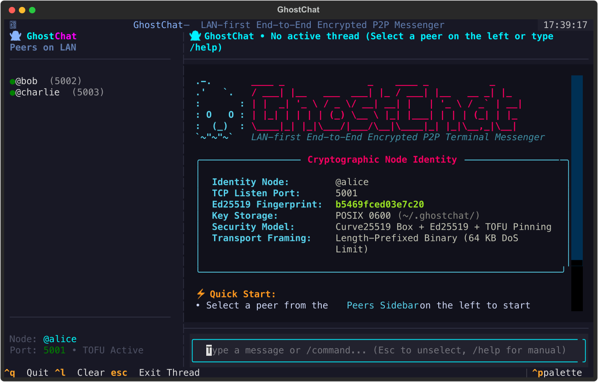
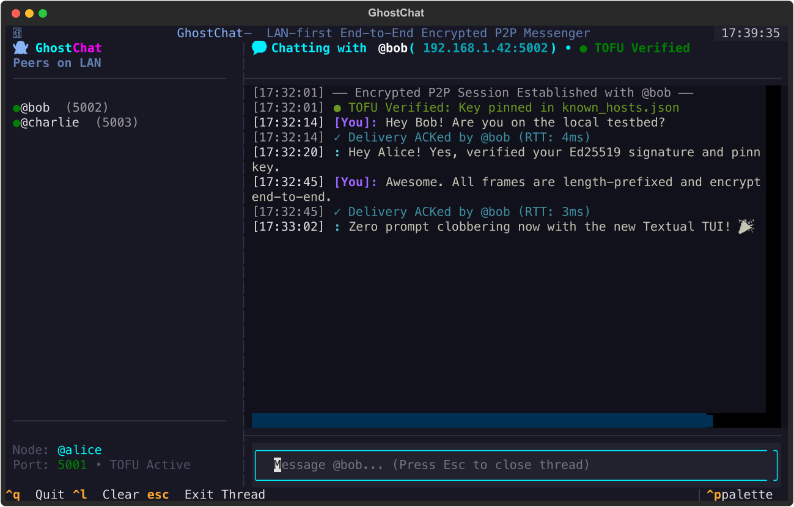
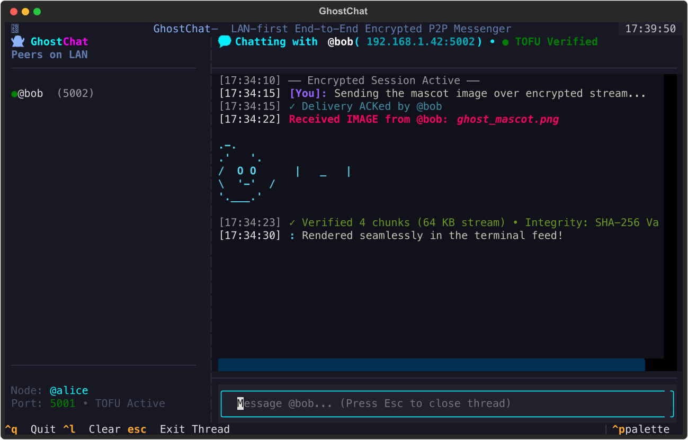

# 🚀 GhostChat Quickstart Guide

Get up and running with **GhostChat** in under 2 minutes. This guide walks you through setting up two local peer nodes (**Alice** and **Bob**), discovering each other over LAN without a central server, exchanging end-to-end encrypted messages with delivery confirmations, and sending encrypted media rendered as ASCII art.

---

## 📋 Prerequisites

- **Python**: Version 3.9 or newer (tested on 3.11+)
- **Package Manager**: [Poetry](https://python-poetry.org/) (recommended) or `pip`
- **Operating System**: macOS, Linux, or Windows (WSL / Windows Terminal)

---

## ⚡ Step 1: Clone & Install

Clone the repository and install dependencies:

```bash
git clone https://github.com/yash-vrdhan/ghostChat.git
cd ghostChat
```

### Option A: Using Poetry (Recommended)
```bash
poetry install
```

### Option B: Using Pip
```bash
pip install -e .
```

---

## 👻 Step 2: Launch Node 1 (Alice)

Open your first terminal window and launch Alice's node:

```bash
poetry run ghostchat --username alice --port 5001
```

Upon launch, GhostChat displays the **Welcome Dashboard & Cryptographic Identity**:

<p align="center">
  
</p>

### What Just Happened?
1. **Key Generation**: A unique Curve25519 encryption keypair and an Ed25519 signing keypair were generated and safely stored under `~/.ghostchat/alice/` with strict POSIX permissions (`0600` for secret keys, `0700` for the directory).
2. **Identity Verification**: Alice's node fingerprint (e.g. `b5469fced03e7c20`) is displayed in the **Cryptographic Node Identity** panel.
3. **LAN Discovery Listener**: A UDP broadcast listener was spawned on `:54545`, broadcasting signed discovery beacons every 5 seconds.

---

## 📡 Step 3: Launch Node 2 (Bob)

Open a **second terminal window** (or split pane) and start Bob's node on a different port:

```bash
poetry run ghostchat --username bob --port 5002
```

### Zero-Configuration Discovery
Within 1–2 seconds, both nodes will automatically detect each other over local UDP broadcast:
- **Alice's sidebar** updates in real-time to show: `● @bob (5002)`
- **Bob's sidebar** updates to show: `● @alice (5001)`
- The green dot (`●`) confirms **Trust-On-First-Use (TOFU)** key pinning: each peer verified the other's Ed25519 signature and pinned their public key into `~/.ghostchat/<username>/known_hosts.json`.

---

## 💬 Step 4: Open an Encrypted Chat Thread

On Alice's terminal, you can open a dedicated chat thread with Bob by either:
1. **Clicking on `@bob`** in the left sidebar, or
2. Pressing `Tab` to focus the peer sidebar and hitting `Enter`, or
3. Typing `/chat bob` in the message input and hitting `Enter`.

The interface will smoothly switch from the Welcome Dashboard to the **Conversation Feed**:

<p align="center">
  
</p>

### Chat Features at a Glance:
- **Header Status**: Displays `Chatting with @bob (192.168.1.42:5002) • ● TOFU Verified`.
- **End-to-End Encryption**: Every message is authenticated and encrypted via Curve25519 (`PyNaCl Box`) using length-prefixed binary framing.
- **Delivery Confirmations**: Each message displays a cyan delivery receipt upon receiving an encrypted TCP ACK packet:
  ```text
  [17:32:14] [You]: Hey Bob! Are you on the local testbed?
  [17:32:14] ✓ Delivery ACKed by @bob (RTT: 4ms)
  ```
- **Isolated Input Dock**: The bottom input bar remains completely visible and stable at all times. Network packets, delivery ACKs, and peer status changes will never interrupt or clobber your typing cursor.

---

## 🖼️ Step 5: Send Encrypted Media (Terminal ASCII Rendering)

GhostChat supports transferring images and animated GIFs over encrypted streams, rendering them as terminal ASCII art upon receipt!

In your active chat thread with Bob, type:
```text
/sendimg path/to/image.png
```
Or send directly from the dashboard:
```text
/sendimg bob path/to/image.png
```

<p align="center">
  
</p>

### Under the Hood:
1. The image is optimized, scaled, and split into 64 KB binary chunks.
2. Each chunk is individually signed with Ed25519 and encrypted with Curve25519.
3. Upon receiving all chunks, the receiver validates the SHA-256 integrity hash and converts the image into colored ASCII art directly within the chat feed.

---

## ⌨️ Step 6: Navigation & Keyboard Shortcuts

| Key / Command | Action | Description |
| :--- | :--- | :--- |
| `Esc` | **Exit Thread** | Unselects the active peer and returns to the Welcome Dashboard |
| `Tab` | **Focus Peers** | Moves focus between the message input box and the sidebar |
| `Ctrl + Q` | **Quit** | Gracefully disconnects sockets and closes GhostChat |
| `Ctrl + L` | **Clear Feed** | Clears the message log in the current view |
| `Enter` | **Send / Select** | Sends typed message or opens selected peer in sidebar |

---

## 📜 Step 7: Slash Commands Reference

Type these commands directly into the bottom input bar:

| Command | Syntax | Description |
| :--- | :--- | :--- |
| `/peers` | `/peers` | Displays a list of all currently discovered LAN peers |
| `/chat` | `/chat <target>` | Opens a thread with target (`username`, `user@port`, or `ip:port`) |
| `/msg` | `/msg <target> <text>` | Sends a one-off encrypted message without opening a thread |
| `/sendimg` | `/sendimg <target> <file>` | Sends an encrypted image rendered as ASCII |
| `/sendgif` | `/sendgif <target> <file>` | Sends an encrypted animated GIF rendered as ASCII |
| `/exit` | `/exit` or `/close` | Closes the current thread and returns to the dashboard |
| `/help` | `/help` | Displays the in-app command reference |
| `/quit` | `/quit` | Safely terminates GhostChat |

---

## 🖥️ Headless / Minimal CLI Mode

If you are running in a minimal shell, over an SSH jump host, or in an automated CI/CD pipeline, you can run GhostChat in classic command-line mode using `--cli`:

```bash
poetry run ghostchat --username alice --port 5001 --cli
```

In `--cli` mode, GhostChat provides the exact same security, discovery, and transport capabilities via a traditional command loop.

---

## 🛡️ Security Checks to Try

To test GhostChat's security architecture:

1. **Verify Key File Permissions**:
   ```bash
   ls -la ~/.ghostchat/alice/
   # Notice secret keys have -rw------- (0600) and directories have drwx------ (0700)
   ```
2. **Inspect Pinned Known Hosts (TOFU)**:
   ```bash
   cat ~/.ghostchat/alice/known_hosts.json
   # View the Ed25519 and Curve25519 public keys pinned for Bob
   ```
3. **Run the Automated Security Test Suite**:
   ```bash
   poetry run pytest -v
   # All 22 tests validating encryption, signatures, framing, and TUI
   ```

---

> 💡 **Want to learn how it works under the hood?**  
> Read the complete architectural journal in [LEARNING_AND_IMPLEMENTATION.md](LEARNING_AND_IMPLEMENTATION.md).
